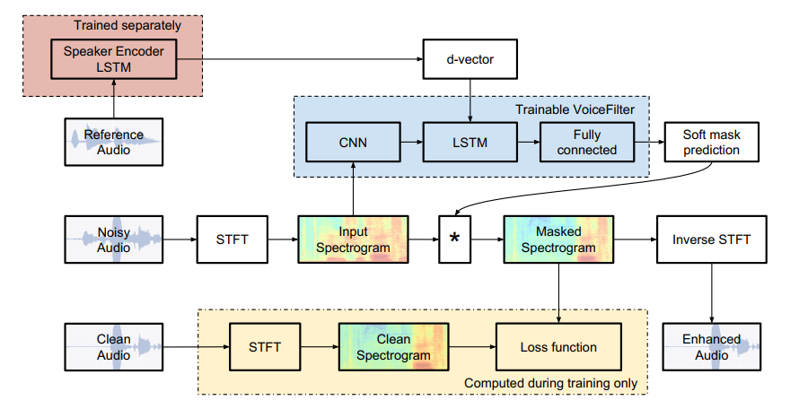

## VoiceFilter

A Pytorch implementation of Google's [VoiceFilter](https://arxiv.org/abs/1810.04826) System



### Usage

1. Data simulation
    ```shell
    ./nnet/data_simulate.py --dump-dir simu/train /path/to/librispeech/train.scp asset/train_tuples.csv
    ./nnet/data_simulate.py --dump-dir simu/dev /path/to/librispeech/dev.scp asset/dev_tuples.csv
    ```
2. Speaker embedding (I used xvector from [here](http://kaldi-asr.org/models/m7))
3. Data prepare

    Prepare data as `{mix,ref,emb}.scp` and the format of scp file follows Kaldi's recipe, egs `<key> <path>` pair in each line.
4. Confugure `nnet/conf.py` and train the model. See `train.sh` for details.


### Note

1. I used Si-SNR loss instead of MSE of spectrogram, which could achieve better perfermance.